## About ##

This is a sample method to calibrate camera and lidar jointly. I think this method is suitable for 16, 32, 64 line-lidar. If you want to run this code successfully, please read the discription carefully. 

## Steps ##

### 1. Required software ###

 - PolyWorks 2019.  
 - Matlab 2019a.

### 2. Procedure ###

Doawload this code and perform the following steps.

* **Base requirements**
1. All images must be undistorted. This matter is of the utmost importance.
2. Calibration board requires black and white checkerboard lattice and one side is odd, one side is even.
3. The short edge of the chessboard should be at the top of the image. The edges of the checkerboard cannot be parallel to the edges of the image. Pose of chessboard in image must look like fisrt row shown below (second row is wrong pose):
<div align=center></div>  

4. The short edge of the chessboard of pointcloud should be at the top of the z-axis direction  of lidar. The edges of the checkerboard of pointcloud cannot be parallel to the z-axis of lidar.
<div align=center></div>

* **Data Storage**

1. Put your camera images (`.png`) into `data/images` and you have to name it numerically.
2. Put your lidar data (`.txt`) into `data/pointcloud` and each line of the file has only xyz coordinates, for example:
```
    0.5363237262 -0.3014609218 -0.1039963961
    0.5608119369 -0.3181324303 -0.1093295515
    0.5810572505 -0.3322938681 -0.1137738377
    0.6180613041 -0.3567755520 -0.1217735633
    ...
```
3. You can use command below to covert `.pcd` file to `.txt` file in linux.
```
$ pcl_converter -f ascii 1.pcd dst.pcd
$ cat dst.pcd | grep -v [A-Z] | grep -v [a-z] | cut -f 1,2,3 -d ' ' > 1.txt
```


* **Fit the chessboad to square in the point cloud**

1. open PolyWorks2019 -> tool -> PolyWorks|inspector.
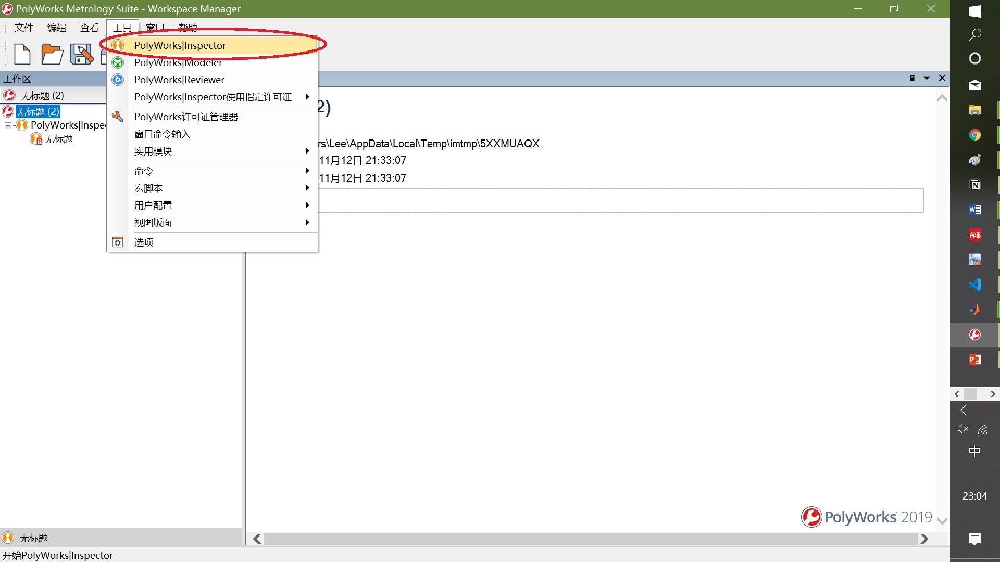
2. file -> input -> pointcloud, choose .txt file
3. only choose 'millimeter' and 'Space', click ok. 
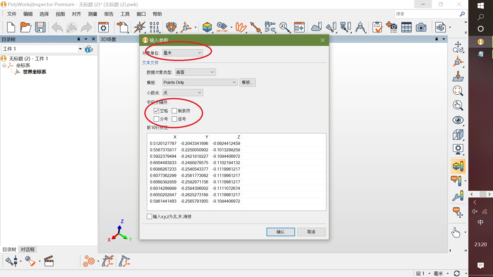
4. choose -> unit -> interaction
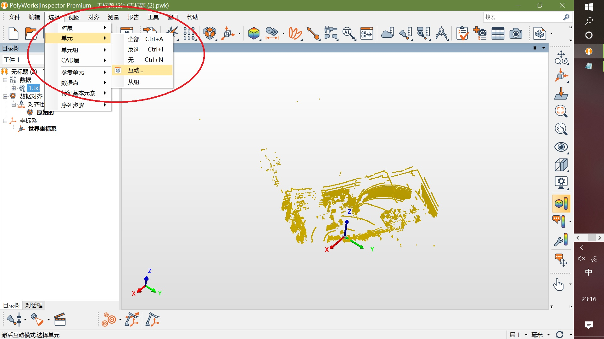
5. choose background points, press delete key to delete these points, only save chessboard points.
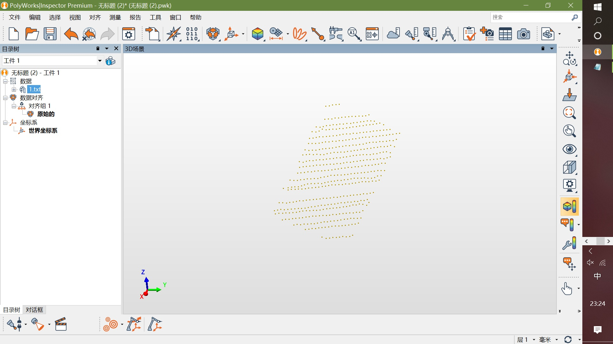
6. measure -> feature -> create
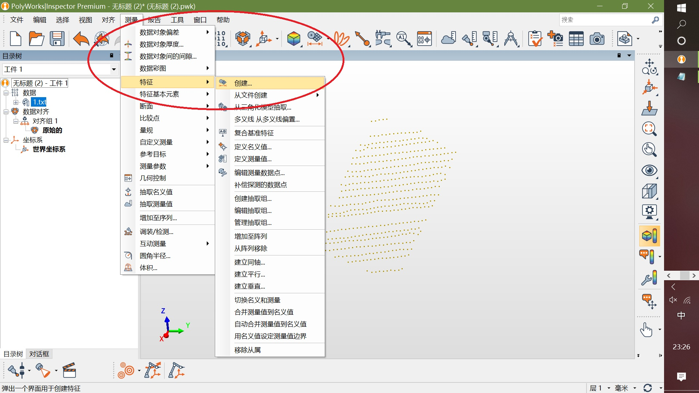
7. choose square
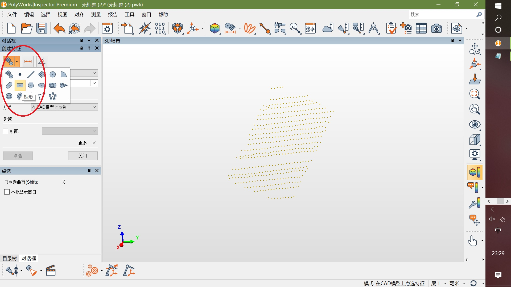
8. choose fitting
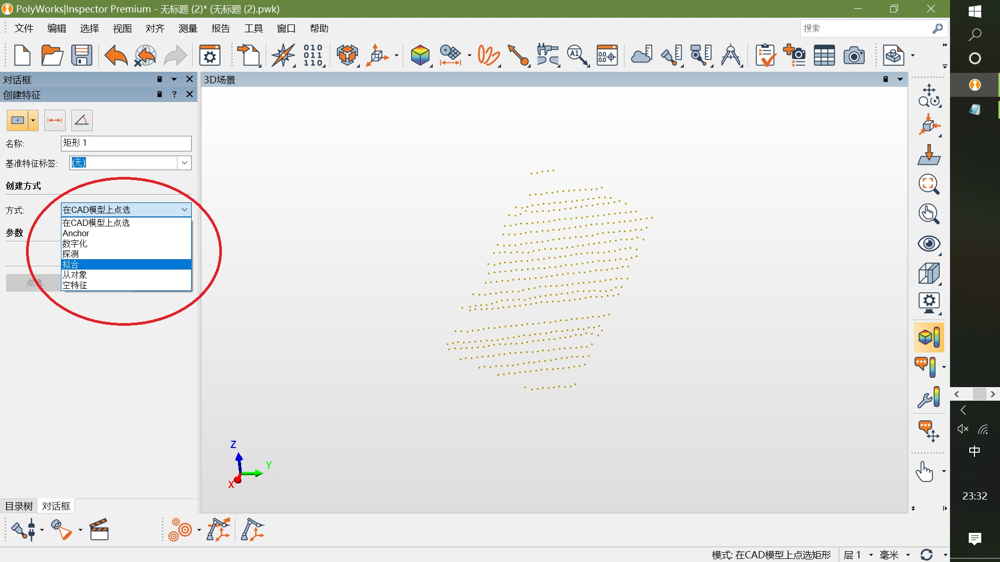
9. modify parameter
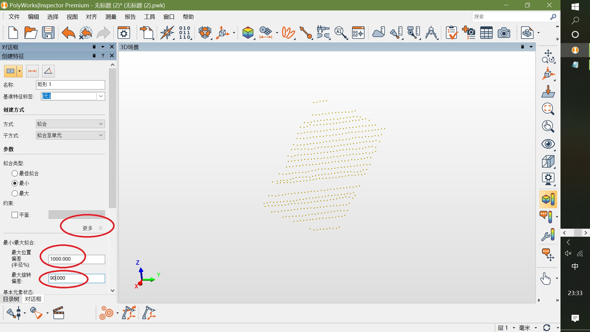
10. choose max
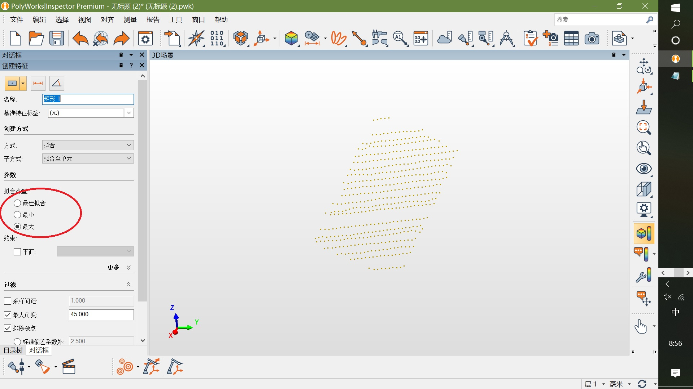
11. choose -> unit -> interaction, choose all the points
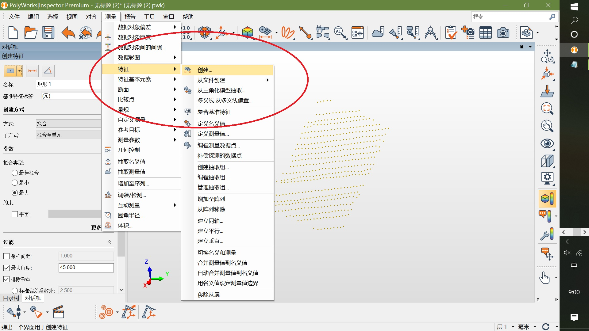
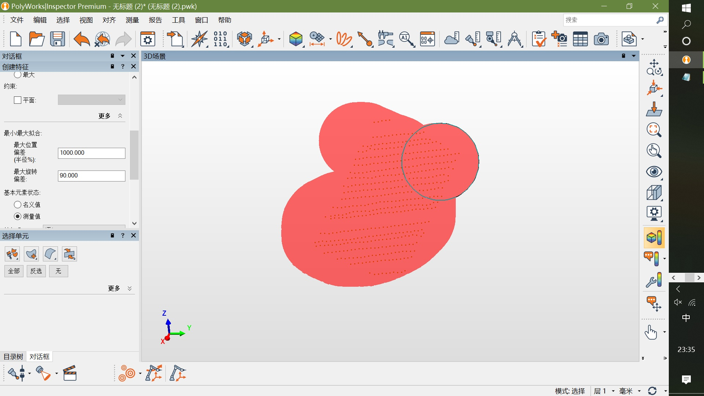
12. creation
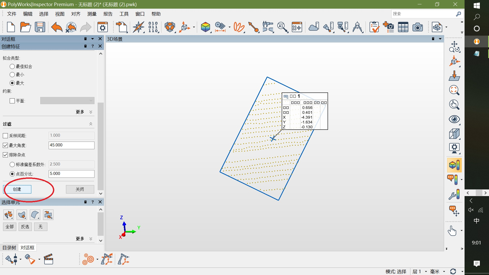
13. square -> output
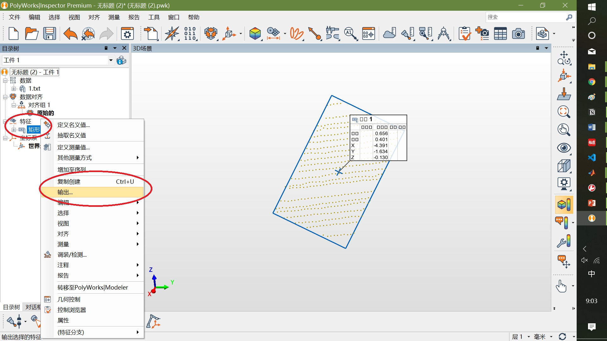
14. Save '.igs' file to `data/chessboard_pointcloud_igs`. Note that the prefix name must be a number and its prefix name must match the prefix name of the image in `data/images`.
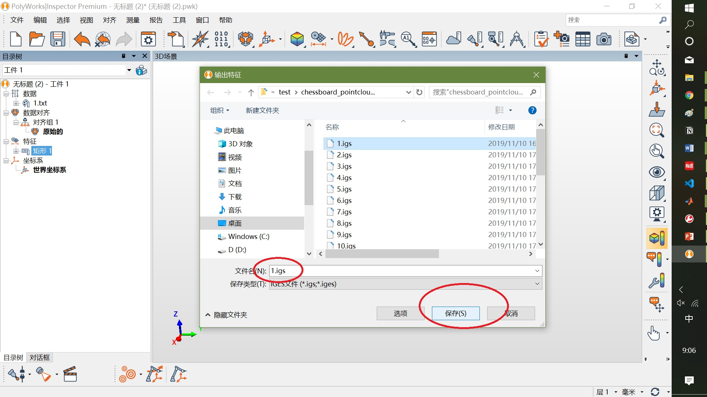

15. Repeat the above steps until all pointcloud of chessboard are fitted.

* **Configuration**

1. Open matlab2019 and change the matlab folder to the root directory `Camera-lidar-joint-calibration/`.
2. Open `joint_calibration.m` file and you need to modify the following options.
```
    x_grids = 5; % number of grids of short edges of chessboard
    y_grids = 8; % number of grids of long edges of chessboard

    imageType = 'png'; % image format

    % camera parameters
    focalLength    = [2525.9, 2528.1]; % fx, fy
    principalPoint = [942.9102, 584.8342]; % cx, cy
    imageSize = [1080, 1920]; % image size
```
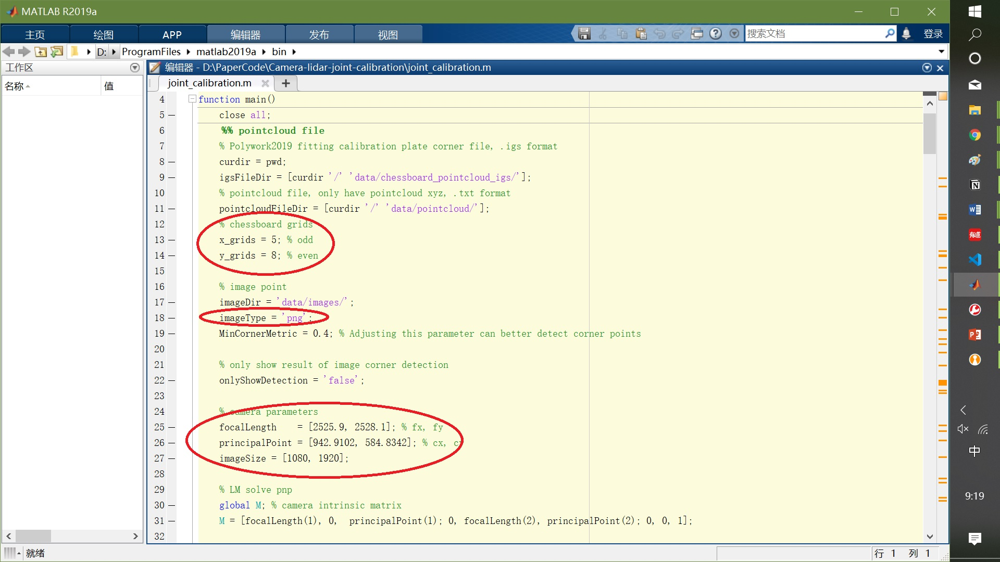

* **Check the result of image corner detection**

1. If you run this code for the first time, you should check the result of image corner detection carefully.  If the corners of some images are not detected successfully, the `MinCornerMetric` parameter needs to be adjusted . So you should modify the configuration as below. 
```
    MinCornerMetric = 0.4; % Adjusting this parameter can better detect corner points
    onlyShowDetection = 'true';% only show result of image corner detection
```
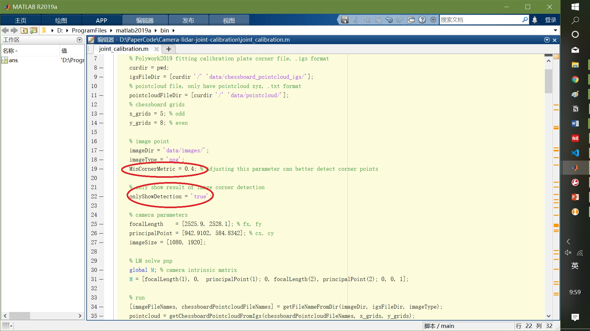

2. Run `joint_calibration.m` to check the result. Green represents the first detected corner.


* **Joint calibration**

1. If corner detection is successful, you should modify the cofiguration to `onlyShowDetection = 'false'` to start calibrating jointly.

2. Reprojection error will be shown in images and the cross symbol represents the reprojection point.
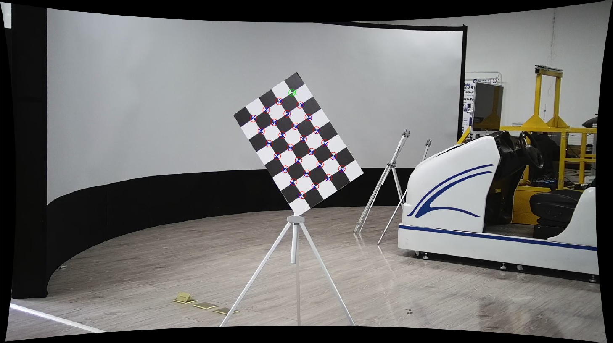

3. All the pointcloud will be prejected into corresponding image.


4. Calibration result `R` and `T` are in the command window.
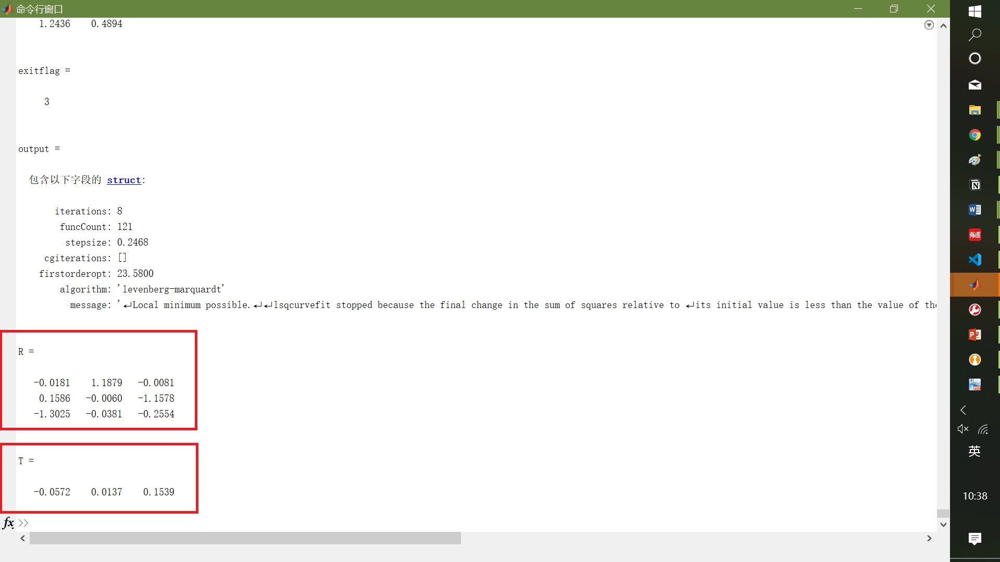

* **Notes**

1. The projection formula from point cloud to image looks like this
```
    Pc = K * R * (Pw - T)
```

2. For better results, you shold use at least 20 pairs pointcloud and images. And the calibration board should cover all positions of the images as much as possible.
